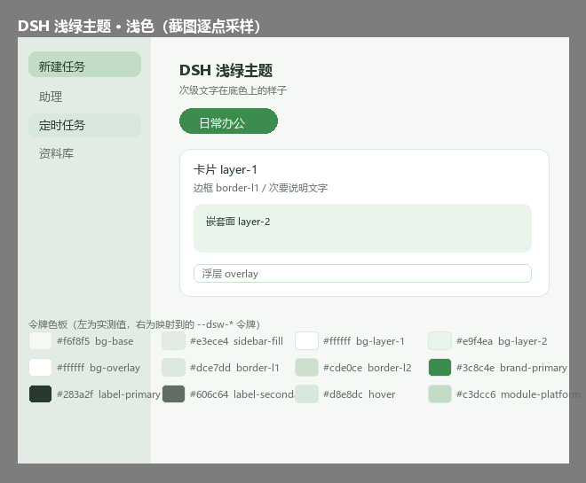

# DSH 浅绿主题

DSH 客户端的浅绿配色主题。覆盖 `--dsw-*` 令牌，并把选中的菜单项和会话行加粗。



## 安装

### 方式一：DSH 界面安装（推荐）

1. 左侧栏点「插件」，再点「添加插件」
2. 输入框里粘下面这行，点「安装」

   ```
   github:catEatRabbit/dsh-light-green-theme
   ```

3. 装完点「立即启用」

装完就是浅绿的，不用重启。

### 方式二：命令行安装

适用于 `dsh web` 这类 profile：

```
dsh plugin --profile web add github:catEatRabbit/dsh-light-green-theme
```

桌面版的 `desktop` profile 不能用命令行装，它被应用独占管理。

### 方式三：本地安装

1. 在仓库页面点绿色的 `Code` 按钮 → `Download ZIP`
2. 解压到任意目录
3. 按方式一操作，第 2 步改成粘那个目录的绝对路径

## 配色

| 用途     | 浅色                    | 深色                    | 令牌                                       |
| ------ | --------------------- | --------------------- | ---------------------------------------- |
| 底色     | `#f6f8f5`             | `#131811`             | `--dsw-alias-bg-base`                    |
| 侧栏     | `#e3ece4`             | `#0c120d`             | `--dsw-specific-sidebar-fill`            |
| 卡片     | `#ffffff`             | `#191f1a`             | `--dsw-alias-bg-layer-1`                 |
| 嵌套面    | `#e9f4ea`             | `#1b321d`             | `--dsw-alias-bg-layer-2`                 |
| 描边     | `#dce7dd` / `#cde0ce` | `#2b402d` / `#375839` | `--dsw-alias-border-l1` / `-l2`          |
| 品牌绿    | `#3c8c4e`             | `#3c8c4e`             | `--dsw-alias-brand-primary`              |
| 正文     | `#283a2f`             | `#dee8e2`             | `--dsw-alias-label-primary`              |
| 次级文字   | `#606c64`             | `#9baba1`             | `--dsw-alias-label-secondary`            |
| 选中     | `#c3dcc6`             | `#325336`             | `--dsw-alias-bg-module-platform`         |
| 悬停     | `#d8e8dc`             | `#233928`             | `--dsw-alias-interactive-bg-hover`       |
| 设置导航选中 | `#c3dcc6`             | `#325336`             | `--dsw-specific-sidebar-nav-item-active` |

浅色一侧是从一张界面截图逐点采样的，深色按同一色相（H≈126°）派生。

要改配色，编辑 `lib/client.js` 里的 `PALETTE`，每项写 `{ light, dark }` 两个值。改完跑 `node verify.mjs`。

## 卸载

侧栏「插件」→「已安装」→ 卸载。
